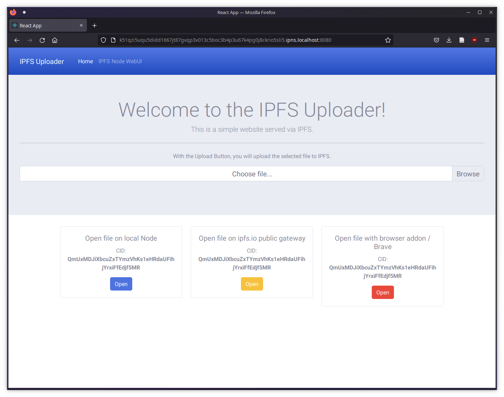

# IPFS Uploader
### INFO: THIS IS AN EXAMPLE OF A TERM PAPER!

This project provides an InterPlanetary File System (IPFS) Node and an IPFS hosted frontend written in React. In the frontend you are able to upload files to IPFS.
As soon as a file had been selected via the file dialog, the file will be added to the local IPFS-Node. The app will provide three Buttons to access the file.

- Open the file on the local IPFS Node
- Open the file with the ipfs.io public gateway (might be slow)
- Open the file with the Brave Browser of a IPFS-Companion browser addon

## Install all dependencies for the frontend app
To install all required dependencies, please run
### `npm install`

## Build the React Frontend
To build the React frontend, run the command
### `npm run build`

## Build the docker container for the IPFS node
To build the docker container for the IPFS Node (golang implementation), run the command
### `docker-compose build`

## Run the docker container
To start the docker container run
### `docker-compose up`

## Publish the built frontend to IPFS
To publish the frontend and configure the nodes CORS settings, run
### `npm run publish`
This will add the files to the local IPFS node, create an IPNS Adress and return its CID.

## Open the application
Use the CID from the previous command to access the UI
### `localhost:8080/ipns/[CID]`
